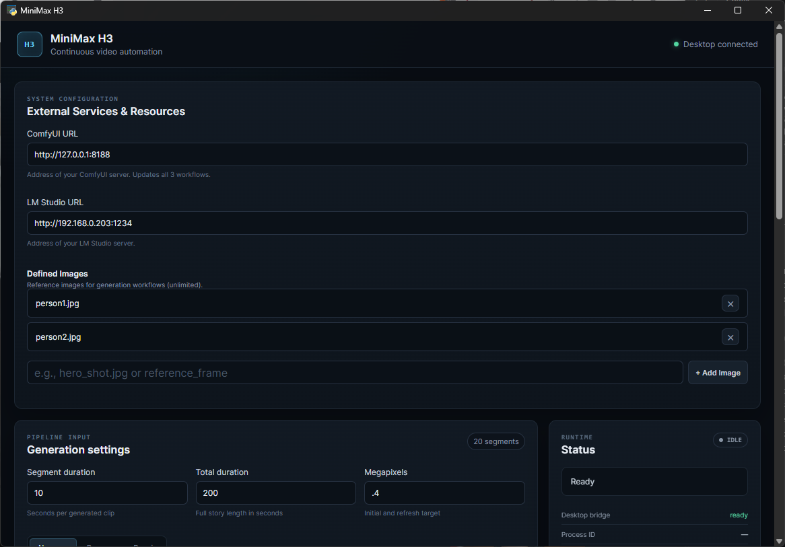

# MiniMaxH3 Continuous Video Automator

> Write a paragraph or a full story, define the characters, have MiniMaxH3 Continuous Video Generator create it.

MiniMaxH3 Continuous Video Automator turns a written story or creative brief
into a continuous sequence of MiniMax H3 video clips. It uses LLM host as the
writer/director and ComfyUI as the renderer, then joins the clips into one MP4.

The desktop app is the easiest way to use it. The command line is available for
scripts, remote machines, and repeatable runs.

This project does not provide the MiniMax H3 model weights, ComfyUI, or an LLM.
You supply those separately and connect them through the setup below.

## What it does

- Accepts a paragraph, outline, or full story in `story.txt`.
- Optionally turns the story into an ordered beat list and a saved story arc.
- Uses `subjects.txt` and up to six reference images to keep characters and
  visual identity consistent.
- Asks LLM host for one directed shot at a time and formats it for MiniMax H3.
- Uses initial, continuation, and optional clean-refresh ComfyUI workflows.
- Checkpoints successful segments so an interrupted run can resume.
- Trims continuation overlap frames and writes `final.mp4` with FFmpeg.

Each segment is one directed shot. The generator tracks beat completion,
subject identity, wardrobe, props, camera state, and other continuity facts in
`generation_state.json`.

## Hardware and software requirements

There is no single guaranteed hardware minimum because the required VRAM and
RAM depend on the workflow resolution, segment length, and ComfyUI setup. As a
practical starting point, use a GPU with about 16 GB VRAM and start at `0.2`
megapixels. More demanding runs may need 32 GB VRAM and substantial system RAM,
or two machines sharing the workload. In the desktop app, choose **16 GB** to
generate prompts with the LLM first, then switch GPU services and render with
ComfyUI. Choose **32 GB+** when both services can run together. This setting
controls the available actions; it does not automatically start or stop servers.

You also need:

- Windows 10/11 or a current Linux distribution.
- Python 3.10 or newer.
- A current [ComfyUI installation](https://docs.comfy.org/installation/).
- [LLM host](https://lmstudio.ai/download) with a loaded instruction-following
  model and its local API server enabled.
- [FFmpeg](https://ffmpeg.org/download.html), with both `ffmpeg` and `ffprobe`
  available on `PATH`.
- Enough disk space for MiniMax H3 model files, intermediate clips, and the
  final video.

## Desktop GUI (primary interface)



## How the generation works

The application has three cooperating stages:

1. **Writer:** if `beats.txt` is empty, LLM host expands `story.txt` into a
   macro story arc and then an ordered beat for each requested segment. You can
   also write the beats yourself.
2. **Director:** for each segment, LLM host turns the active beat and the
   committed continuity state into a structured shot, then formats it as a
   MiniMax H3 audiovisual prompt. Python validates the result and keeps beat and
   subject identities consistent.
3. **Renderer/editor:** ComfyUI generates the first shot, continues from the
   preceding shot, and optionally performs clean refreshes. FFmpeg removes the
   configured overlap frames and joins the clips into `final.mp4`.

When the append workflow loads the preceding clip, it passes its final 3 seconds
(72 frames at 24 fps) into the continuation workflow.

The generator can run unattended for long jobs, but it cannot guarantee that an
LLM or video model will produce a perfect shot every time. Start with a short,
low-resolution test before committing to a longer story.

### Beat-plan validation

Before directing shots, the initially generated beats are treated as a
provisional framework. Validation moves forward one beat at a time. Each
candidate is checked by one semantic validator against the previous finalized
beat, a compacted canonical state snapshot, the current and next beat jobs, and
the Python-assigned typed state effects. The validator accepts paraphrases and
reasonable implications; it does not perform exact string matching or
revalidate the complete source story or phase goal.

The compact state removes empty/default values and bookkeeping noise such as
version, required-event progress lists, and duplicated persistent-effect
metadata while preserving established facts. Python remains the authority for
committing typed effects: rejected candidates cannot mutate state, and effects
are applied only after the single validator returns `valid: true`.

Validation progress is checkpointed after each finalized beat, so a resumed run
continues from the last committed beat without revalidating immutable history.

Beat validation progress is checkpointed in `beat_validation_state.json`,
including finalized beat text, state-after snapshots, current state,
required-event progress, and the next window. Resuming after Beat 8 starts at
Window `8-12` without revalidating Beats 1-8. At completion Python performs only
deterministic structural checks before writing `beats.txt`; there is no whole-plan
semantic audit or whole-plan regeneration.

Phase-ending beats are not finalized until every required-event ID for the phase
has been explicitly established by finalized beat prose. `required_end_state` is
the macro-plan summary of those events, not a second free-text semantic gate.
Continuity checks treat canonical state as authoritative for locations,
containment, objects, weapons, barriers, injuries, environmental damage, and
persistent threats. New threats receive stable Python-allocated IDs, unsupported
prior entity history is rejected, active entities persist until explicitly
resolved, and obvious planning annotations are removed or retried locally before
beats are written.

## GUI Launch

After completing the setup below, start the application from the project
directory:

```powershell
python desktop_app.py
```

Use the GUI to prepare project files, configure a new run or resume/repair an
existing one, start and stop generation, and follow segment progress without
constructing command-line arguments. See [Run from the desktop app](#run-from-the-desktop-app-recommended)
for the complete workflow.

The program uses:

- **LLM host** to turn a story and ordered beat list into one directed shot at
  a time.
- **ComfyUI** to render the first clip and extend it with later clips.
- **FFmpeg** to remove overlap frames and concatenate the clips into a final
  MP4.

The automation checkpoints every successful segment, tracks completed story
beats, and keeps LLM host context bounded to structured continuity state plus
the two newest exact prompts. An interrupted run can resume without
regenerating completed clips.

> **Platform note:** the complete workflow runs on Windows or Linux. Python
> invokes FFmpeg directly for final stitching. `stitch.bat` is retained only as
> an optional Windows convenience.

## What the pipeline does

1. Reads `story.txt`, `beats.txt`, and optional `subjects.txt` and
   `phrase_exclusions.txt`.
2. Requests a structured shot description from an LLM host model.
3. Normalizes and validates that description locally with deterministic Python
   rules, then inserts it into the correct ComfyUI API workflow.
4. Generates the initial clip or extends the previous clip.
5. Saves beat progress and an atomic resume checkpoint after each successful
   clip.
6. Trims two overlap frames from every clip after the first.
7. Concatenates the clips into `final.mp4`.

## Before you begin

You need:

- Windows 10/11 or a current Linux distribution.
- A recent NVIDIA GPU and enough system RAM, VRAM, and disk space for the
  MiniMax H3 model. Start at `0.2` megapixels if you are unsure what your GPU
  can handle.
- [Git](https://git-scm.com/downloads).
- [Python 3.10 or newer](https://www.python.org/downloads/).
- A current [ComfyUI installation](https://docs.comfy.org/installation/).
- [LLM host](https://lmstudio.ai/download).
- [FFmpeg](https://ffmpeg.org/download.html), including both `ffmpeg` and
  `ffprobe` on `PATH`.

The model downloads are large. Confirm that the drive containing
`ComfyUI/models` has substantial free space before starting.

## Quick-start checklist (desktop GUI)

Complete these once, in order:

1. Install Python and the project dependencies.
2. Install or update ComfyUI.
3. Install the five required custom-node packages.
4. Download the model, text encoder, VAE, and LoRA files selected by the
   supplied workflows.
5. Optionally place up to six reference images in `ComfyUI/input` and assign
   them in both reference-to-video workflows.
6. Load an LLM in LLM host and start its local API server.
7. Set filesystem environment variables if their defaults do not match your
   system, then launch `desktop_app.py`.
8. Use **Files & configuration** in the GUI to create `story.txt`, `beats.txt`,
   and optionally `subjects.txt` and `phrase_exclusions.txt`.
9. Complete the preflight checks, enter a short test run in **Generation
    settings**, and select **Generate**.

The following sections explain each step.

## 1. Set up Python and launch the desktop app

Run these commands from the project directory.

### Windows PowerShell

```powershell
python -m venv .venv
.\.venv\Scripts\Activate.ps1
python -m pip install --upgrade pip
python -m pip install -r requirements.txt
```

If PowerShell blocks activation, either allow locally created scripts for your
user account or call the environment's Python directly:

```powershell
.\.venv\Scripts\python.exe -m pip install -r requirements.txt
```

Verify the installation:

```powershell
python --version
python -c "import requests; from PIL import Image; print(requests.__version__, Image.__version__)"
```

The Python packages required by the project are `requests`, `Pillow`, and
`pywebview`.

### Linux

On Debian or Ubuntu, install Python and FFmpeg, then create an isolated Python
environment:

```bash
sudo apt update
sudo apt install python3 python3-venv python3-pip ffmpeg
cd /path/to/automate_git
python3 -m venv .venv
source .venv/bin/activate
python -m pip install --upgrade pip
python -m pip install -r requirements.txt
```

Use your distribution's equivalent package names when necessary.

Pywebview also requires a supported native GUI backend on Linux. Install the
matching `pywebview[gtk]` or `pywebview[qt]` extra and the system packages for
your distribution.

### Launch the GUI

With the Python environment active, run this from the project directory:

```powershell
python desktop_app.py
```

The checked-in production interface is loaded directly from
`frontend/dist/index.html`; no browser or web server is started. The GUI then
runs `minimax.py` as a subprocess, shows its live console output and segment
progress, and exposes an emergency **Stop generation** control. Closing the
window also stops an active local process. Work already queued on a remote
ComfyUI server may still need to be cancelled in ComfyUI.

The **Files & configuration** editor lets you edit the story, beats, subjects,
and phrase-exclusion files. Workflow JSON and `generation_state.json` are
available there as read-only references, and file editing is disabled during
generation.

Node and npm are needed only when changing the React frontend. To rebuild it:

```powershell
cd frontend
npm install
npm run build
cd ..
```

During frontend development, `npm run dev` is also available. A normal browser
does not have the pywebview bridge, so generation controls remain disabled
there.

## 2. Install and update ComfyUI

Install ComfyUI using the
[official installation instructions](https://docs.comfy.org/installation/) or
use an existing installation.

MiniMax H3 support is native in current ComfyUI releases. Update an older
installation before loading these workflows. The supplied workflows use
MiniMax H3, AV decoding, video creation, math-expression, and resolution nodes.

Start ComfyUI and leave it running while the automation is active. Its default
address is:

```text
http://127.0.0.1:8188
```

Check the server from PowerShell:

```powershell
Invoke-RestMethod http://127.0.0.1:8188/system_stats
```

A JSON response means the API is reachable. There is no separate API-mode
switch required for a normal local ComfyUI server.

## 3. Install the required ComfyUI custom nodes

The easiest method is ComfyUI Manager: open **Manager**, choose **Install
Custom Nodes**, search for each package below, install it, and restart ComfyUI.

| Package | Nodes used by these workflows |
|---|---|
| [ComfyUI-MiniMax-H3-Turbo](https://github.com/Larryvrh/ComfyUI-MiniMax-H3-Turbo) | `MiniMaxH3TurboLoRA` |
| [ComfyUI-KJNodes](https://github.com/kijai/ComfyUI-KJNodes) | `PathchSageAttentionKJ` |
| [ComfyUI-VideoHelperSuite](https://github.com/Kosinkadink/ComfyUI-VideoHelperSuite) | `VHS_LoadVideoPath` |
| [ComfyUI-DynamicPrompts](https://github.com/adieyal/comfyui-dynamicprompts) | `DPRandomGenerator` |
| [MiniMax H3 Hybrid Cond](https://github.com/kitsune123150/minimax-h3-hybrid-cond) | `MiniMaxH3HybridRefAndKeyframe` used by the refresh workflow |

Even though Python replaces the prompt text, Dynamic Prompts must still be
installed because the workflow contains a `DPRandomGenerator` node.

### Manual custom-node installation

If a package is unavailable in Manager, open PowerShell in
`ComfyUI/custom_nodes` and clone it:

```powershell
git clone https://github.com/Larryvrh/ComfyUI-MiniMax-H3-Turbo.git
git clone https://github.com/kijai/ComfyUI-KJNodes.git
git clone https://github.com/Kosinkadink/ComfyUI-VideoHelperSuite.git
git clone https://github.com/adieyal/comfyui-dynamicprompts.git
git clone https://github.com/kitsune123150/minimax-h3-hybrid-cond.git
```

Install each package's Python requirements with the same Python environment
used by ComfyUI, then restart ComfyUI. For a portable build, that is normally
`python_embeded/python.exe`, not your system Python.

### MiniMax H3 hybrid conditioning patch

The repository also contains an optional ComfyUI custom-node module in
`__init__.py` for saving and loading MiniMax H3 audio/video latent checkpoints.
The three supplied workflows do not require those nodes. The repository's
`model_base_patch.py` is a compatibility patch for the external
`minimax-h3-hybrid-cond` package and is only needed when that package's installed
version lacks the defensive latent filtering described below.

The patch is loaded by the external hybrid-conditioning package when ComfyUI
starts. It patches `MiniMaxH3.extra_conds` so the refresh workflow can combine
its extracted first-frame keyframe with the normal reference images in one
conditioning payload.

Some versions of this patch assume every keyframe dictionary contains a
`latent` value. A conditioning pass may retain keyframe layout metadata without
that value, producing this error before sampling and Save Latent can run:

```text
model_base_patch.py, line 30, in extra_conds_with_hybrid
KeyError: 'latent'
```

The corrected patch filters both keyframes and references with
`item.get("latent") is not None` before adding their latents. This matches the
defensive behavior in ComfyUI's native MiniMax H3 implementation while keeping
valid keyframe and reference latents in order. After installing the node,
overwrite its `model_base_patch.py` with the copy in this repository only if the
installed package does not already include the fix.

### Optional SageAttention acceleration

The workflows contain KJNodes' `Patch Sage Attention KJ` node. SageAttention
can improve speed but is an optional, hardware-specific dependency. Install a
wheel matching the exact PyTorch and CUDA versions in your ComfyUI environment.
If you do not install it, disable or bypass Sage Attention in the workflow and
export the API workflow again.

## 4. Download the required models

The base model, text encoder, and VAEs are available from
[Comfy-Org/MiniMax-H3](https://huggingface.co/Comfy-Org/MiniMax-H3). The Turbo
node and current Turbo weights are documented in
[Larryvrh/ComfyUI-MiniMax-H3-Turbo](https://github.com/Larryvrh/ComfyUI-MiniMax-H3-Turbo).

The supplied API workflows currently select these relative paths:

```text
ComfyUI/
└── models/
    ├── diffusion_models/
    │   └── minimaxH3INT8INT4_ref2vaINT8Pruned.safetensors
    ├── text_encoders/
    │   └── qwen3vl_32b_minimax_h3_nvfp4_awq.safetensors
    ├── vae/
    │   ├── minimax_h3_audio_vae_fp32.safetensors
    │   └── minimax_h3_video_vae_fp16.safetensors
    └── loras/
        └── MiniMaxH3/
            └── minimax_h3_fl2v_turbo_8step_v1.0_comfyui_bf16.safetensors
```

Nested model paths use `/` in the checked-in JSON. Python converts those paths
to the separator expected by the current operating system before submitting a
workflow, so the same JSON works on Windows and Linux.

All three checked-in workflows currently select the same `ref2va` diffusion
model and Turbo LoRA filename shown above. These are the filenames in this
repository's JSON, not a promise that a download will use the same names. If
you install compatible files with different names, select those files in the
workflow nodes and export the workflows again in API format.

After adding models, restart ComfyUI so its model lists refresh.

## 5. Configure up to six reference images

Reference images are optional, but they are useful for keeping characters,
props, or locations consistent. The workflows support up to six ordered images;
unused slots are disconnected automatically. Their order must stay consistent
between the initial, append, and refresh workflows:

| Prompt tag | Initial workflow input | Append workflow input |
|---|---|---|
| `<Picture 1>` | `ref_images.ref_image_0` | `ref_images.ref_image_0` |
| `<Picture 2>` | `ref_images.ref_image_1` | `ref_images.ref_image_1` |
| `<Picture 3>` | `ref_images.ref_image_2` | `ref_images.ref_image_2` |
| `<Picture 4>` | `ref_images.ref_image_3` | `ref_images.ref_image_3` |
| `<Picture 5>` | `ref_images.ref_image_4` | `ref_images.ref_image_4` |
| `<Picture 6>` | `ref_images.ref_image_5` | `ref_images.ref_image_5` |

Before any workflow is queued, the program opens and verifies each configured
image from the ComfyUI input folder. It restores every valid `Load Image`
connection to its exact numbered destination and disconnects missing or
undecodable slots. For real identity continuity:

1. Copy the reference images into `ComfyUI/input`.
2. In the initial and append workflows, assign them to the clearly titled
   `Reference Image 1` through `Reference Image 6` nodes in the same order. The
   refresh workflow receives the initial workflow's filenames automatically.
3. Export each workflow in **API format**, keeping these filenames:
   `Minimax_auto_API.json` and `Minimax_auto_append_API.json`.
4. Keep the automation-controlled node titles unchanged: `Float (duration)`,
   `Prompt`, `RandomNoise`, `Save Video`, `Resolution Selector`, `Reference
   Image 1` through `Reference Image 6`, and `Load_Video`.

Numeric ComfyUI node IDs may change when you export. That is safe: the Python
program finds automation-controlled nodes by title, not by node number.

Each line in `beats.txt` may end with any number of beat-specific LoRA options:

```text
1. The portal opens --lora my_style.safetensors:0.8 --lora portal_glow.safetensors:0.45
```

The options are removed before beat text is sent to the LLM and apply while
that beat is active. Every option requires the exact
`[lora_name]:[strength]` form. There is no fallback LoRA and
`default.safetensors` is not required.

Use **Global LoRAs** in the desktop app to apply any number of LoRAs to every
beat. On the command line, repeat `--lora [lora_name]:[strength]` for the same
result. Beat-specific LoRAs are appended after the global LoRAs in the order
written; duplicate names are preserved. For each segment, the program removes
the workflow's blank placeholder when the merged list is empty, reuses it for
the first LoRA, and adds/chains as many additional `LoraLoaderModelOnly` nodes
as needed in both API workflows. These specific LoRAs are looked for in the
configured LoRA directory. The GUI and CLI both accept a custom `--lora_dir`
directory; the default in this checkout is `/mnt/h/StableDiffusion/loras`.

At startup, each global LoRA is verified in the configured directory immediately
after the reference images are checked. Every verified LoRA and its strength are
printed before generation.

To automatically generate beats while applying one LoRA to every generated beat,
put only a file-level directive in `beats.txt` (comments and blank lines are also
allowed):

```text
--lora minimax_h3_lighting.safetensors:1.0
```

The directive is metadata, not a story beat. The program treats the file as empty,
generates the required number of beats, and appends the directive to every saved
beat. This file-level form requires an explicit strength.

## 6. Set up LLM host

Every LLM host chat-completions request includes a randomly generated positive
31-bit `seed`. Transport retries receive a new seed, while the structured-output
fallback for the same attempt keeps that attempt's seed. The seed is also stored
in `prompt_history.txt` metadata so a request can be reproduced.

1. Install and open [LLM host](https://lmstudio.ai/).
2. Download and load the current tested local model (Mistral Small 3.2 24B, or
   another compatible instruction-following model).
3. The current local Mistral 24B setup uses a context window of about **6,044
   tokens**. Prompt stages must therefore stay deliberately small; do not rely on
   the older 13B-era guidance that assumed a ~21,000-token context window.
4. In LLM host's **Developer** area, start the local API server.
5. Confirm that the model supports the OpenAI-compatible chat-completions
   endpoint and structured JSON-schema output.

The default LLM host server is commonly available at:

```text
http://127.0.0.1:1234
```

The checked-in `minimax.py` defaults to `http://192.168.0.203:1234`. Override
`MINIMAX_LLM_HOST_URL` for a different server. The script does not send a
model name to LLM host; it uses whichever chat model the user has loaded.
If LLM host and this script run on the same computer, use:

```powershell
$env:MINIMAX_LLM_HOST_URL = "http://127.0.0.1:1234"
```

Test the server from PowerShell:

```powershell
Invoke-RestMethod http://127.0.0.1:1234/v1/models
```

For remote LLM host hosts, enable network serving in LLM host, use the host
computer's LAN IP, and allow the port through its firewall.

## 7. Configure connections and paths

The desktop app exposes ComfyUI and LLM host URLs and passes the saved values
to the generator. Filesystem overrides still come from environment variables.
Linux defaults to `~/AI/ComfyUI/input` and `~/AI/ComfyUI/output`; Windows
defaults to `H:\images\input` and `H:\images\output` in this checkout. Override
any value that differs on your computer.

Linux (`bash` or `zsh`):

```bash
export MINIMAX_COMFYUI_ROOT="$HOME/ComfyUI"
export MINIMAX_COMFYUI_OUTPUT="$HOME/ComfyUI/output"
export MINIMAX_COMFYUI_INPUT="$HOME/ComfyUI/input"
export MINIMAX_VIDEO_OUTPUT="$HOME/ComfyUI/output/video"
export MINIMAX_COMFY_URL="http://127.0.0.1:8188"
export MINIMAX_LLM_HOST_URL="http://127.0.0.1:1234"
```

Windows PowerShell:

```powershell
$env:MINIMAX_COMFYUI_ROOT = "C:\ComfyUI_windows_portable\ComfyUI"
$env:MINIMAX_COMFYUI_OUTPUT = "H:\images\output"
$env:MINIMAX_COMFYUI_INPUT = "H:\images\input"
$env:MINIMAX_VIDEO_OUTPUT = "H:\images\output\video"
$env:MINIMAX_COMFY_URL = "http://127.0.0.1:8188"
$env:MINIMAX_LLM_HOST_URL = "http://192.168.0.203:1234"
```

`MINIMAX_COMFYUI_OUTPUT` must be the output directory used by the ComfyUI
instance at `MINIMAX_COMFY_URL`. ComfyUI and this script must see generated
files at the same path. For a container or remote server, mount or share that
directory accordingly.

## 8. Install and verify FFmpeg

Install [FFmpeg](https://ffmpeg.org/download.html) and make sure its executables
are on `PATH`. Open a new terminal and verify both commands:

```powershell
ffmpeg -version
ffprobe -version
```

`ffprobe` validates each generated clip's resolution. Python calls `ffmpeg` to
concatenate the completed clips, trimming the configured number of leading
frames from every segment after the first. `stitch.bat` is not required for
normal runs.

## 9. Prepare the project inputs

Project inputs and workflows resolve relative to `minimax.py`, so the program
can be launched from another working directory.

For normal use, open **Files & configuration** in the desktop app, choose a
file in the left column, edit it, and select **Save**. The same files can also
be edited directly in a text editor when the generator is not running.

### `story.txt` — required

Write the source story or creative brief. It can include setting, characters,
tone, dialogue, clothing, and desired camera behavior.

An optional `beat_instructions: [ ... ]` line can add mandatory requirements to
the beat-generation and beat-review prompts. When it is present, a separate
compliance-edit request audits the candidate beats before they are saved.
Python also verifies common explicit constraints such as exact phrase
placement/count, prohibited words, required phrases, and an exact final
sentence; failed checks trigger another correction.

### `canonical_data.txt` — optional character information

The planning pipeline always calls the LLM to generate `character_canon.json`
from `story.txt` and `subjects.txt`. This optional file adds explicit character
facts; missing or blank files do not skip canon generation.

Write the character facts directly in this file, for example:

```text
Amy is wearing a tight, black tank-top and denim jeans, she is female and 30-years-old.
Will is male and 8-years-old.
Amber is female and 5-years-old.
```

The program converts these statements to `character_canon.json`. Each character
gets age, clothing, and gender; the model supplies a reasonable value when one
of those three is missing. Other facts are included only when stated in the file.
The JSON is regenerated on every planning run, even if an existing file matches
the inputs. Render-Only uses saved prompts and does not call the LLM. The original file
text is also included in the first Director prompt for segment 1. Natural
sentences generated from `character_canon.json` are appended to segment 1’s
H3 `subject_definitions` using the same canon-to-prose formatter used for
character definitions.

### `phrase_exclusions.txt` — optional phrase exclusions

Put one word or phrase per line. When this file exists, its nonblank entries are
added to the story-arc, beat-writing, and both Director prompts. They are
prohibited in generated and hand-authored beats. Matching is case-insensitive
and uses complete word or phrase boundaries, so an excluded word such as `art`
does not reject `cart`. Duplicate entries are ignored. After reference-image
verification, startup prints that the file was found and reports the number of
loaded entries.

### `additional_states.txt` — optional continuity fields

Use this file for extra comma-separated state labels that continuity prompts
should pay attention to. For example:

```text
weather, time of day, emotional state, visible damage
```

The file is optional and is read from the project directory. The included
`additional_states_example.txt` shows the intended format.

### `beats.txt` — optional beat tracking

Write one required story event per non-empty line, in chronological order.
Saved beat files number each event as `N. [beat text]`:

```text
1. Introduce the operator and the group at Location X.
2. An entity appears above Location X.
3. The entity relocates the group while they flee.
```

Blank lines and ordinary lines beginning with `#` are ignored. A line formatted
as `# Phase N` marks the first beat of a new macro phase. The order is
authoritative, numbered beats must be consecutive, and the numeric prefixes are
removed when beat text is loaded. Existing unnumbered hand-authored beat lines
remain supported. The director cannot mark a later beat complete before an
earlier one. If the file is blank or contains only comments, the program first
asks LLM host for a macro story arc, then generates the beats one complete
macro phase at a time. Each phase receives its ordered `required_events` and a
previous-phase final-beat boundary for continuity; recent accepted beats may
also be supplied as useful context. Responses use globally numbered
`beat_number`/`beat_text` objects, and Python validates the phase's exact range,
order, count, uniqueness, and response shape before saving the beat text to
`beats.txt`. The final generated beat must conclude the story. Semantic beat
validity is owned by the single beat validator; Python owns only deterministic
formatting, checkpoint, and canonical-state integrity.

Macro arcs use one semantic KISS loop: create the complete arc, validate its
narrative fidelity, structure, required end states, dependencies, and typed event
`state_effects`, then repair the complete arc when validation fails and validate
the repair again. Every global beat has exactly one required event/job, and
required events form a sequential dependency chain across phase boundaries.
Python enforces those assignments and dependencies deterministically before LLM
arc validation. State effects are explicit operations owned and translated by
Python; arbitrary nested state-field dictionaries are rejected. There is no
independent state-preparation, enrichment, coverage, or claim-tracking stage.

Initial beat generation retries a phase normally through attempt 9. If attempt
10 still fails content validation but contains the required number of
structurally usable beats, that response is retained and passed to the
validation and downstream recovery flow. If attempt 10 is structurally
unusable, requests continue without an error until the next usable beat list is
returned. Arc and beat failures return to their appropriate earlier create or
repair stage and restart the process when a retry scope is exhausted rather than
terminating generation. The production beat validator is a final single-beat `VALID`/`INVALID` gate and
has no repair or rewrite capability. An invalid candidate retries the same
beat; exhausted beat retries regenerate the failed phase and every later phase
from the same macro arc, preserving only finalized phases before the failure.
If those phase retries are exhausted, the complete beat process is retried with
the same arc. A new macro arc is requested only after all same-arc retry scopes
are exhausted. Press `Ctrl+Q` to stop the process at any point.

During beat-validation retries, Python remembers finalized beats and their state
snapshots. A later response cannot reopen them; only the current provisional
window may be repaired.

Each valid macro arc returned by LLM host is written as formatted JSON to
`story_arc.json`, overwriting the previous contents. Its SHA-256 source hash is
written alongside it in `story_arc.json.sha256`. When beats need to be generated,
the saved arc is reused only when that sidecar matches the current `story.txt`
source and the arc validates against the current segment count. During
`--generate-beats`, an existing non-empty `beats.txt` marks the prior arc as
eligible for replacement; an empty or missing `beats.txt` preserves a matching
arc so incomplete beat generation can resume from it. A mismatch between the
requested beat count and the arc's declared count also triggers a new arc. A
missing, malformed, or mismatched hash triggers generation of a new arc and
overwrites both files. Clear either file to request a new arc on the next
automatic beat generation.

Automatically generated beat files include `# Phase N` markers. Video-created
Subjects are retained in structured continuity state when a later phase starts.
Prefetch remains skipped across phase boundaries so each new phase begins
with a fresh director request. Manually authored beat files can use the same
markers.

Beat generation uses `temperature=0.65`, `top_p=0.90`,
`presence_penalty=0.15`, `frequency_penalty=0.15`, and
`repeat_penalty=1.05`. The phase prompt treats the macro story arc as the
authoritative story plan and prioritizes source-story fidelity and chronological
cause-and-effect over unsupported invention.

### `subjects.txt` — optional

Describe persistent subjects and map them to the reference-image tags:

```text
<Subject 1> is the operator, an adult person referenced in <Picture 1>.
<Subject 2> is the companion, a related adult person referenced in <Picture 2>.
```

Subject identity, Picture identity, gender, and speaker identity are separate
mappings. A speaker mapping may be declared with `(S1)` on the subject line.
Picture references establish visual identity/body appearance only; they never
establish current clothing. Current wardrobe comes from the committed
continuity state or a successfully rendered wardrobe change.

If a rendered segment introduces a persistent subject that has no Picture
reference, the continuity updater assigns the next stable `<Subject N>` ID.
Any unregistered entity that speaks is promoted to a Subject immediately and
receives a speaker ID not used by any other Subject. This includes a normally
inanimate entity if it has dialogue. Every `<d>...</d>` block therefore has an
explicit `<Subject N>` attribution and `(SN)` speaker ID; repeated lines from
the same new speaker reuse that identity.
Only after that segment renders successfully, Python registers an internal
definition like this:

```text
<Subject 3> is New Guard, male (S3), continued from <Video 1>.
```

Every new Subject is recorded as `male` or `female` (unknown defaults to
`female`) and receives a unique speaker ID on that same definition line, even
if it has not spoken. The complete Subject record and internal definition list,
including gender, speaker ID, and the same `origin_segment`, are stored in
`generation_state.json`; `subjects.txt` is never modified. Later segments reuse
the ID and origin, combine the internal entry with the file-backed definitions
under `subject_definitions`, and use the immediately preceding `<Video 1>` as
that subject's visual reference. No Picture tag is invented for a video-created
subject. Internal definitions are excluded from the user-source fingerprint, so
registering them does not invalidate `--resume` for the active run.

The checkpoint also stores an append-only Subject identity lock. Segment 1's
Subject IDs and identity metadata are checked against `subjects.txt`; every
later segment is checked against the lock and its prior segment snapshot.
Changes to a Subject's ID, name, gender, Picture mapping, speaker ID, or origin
are rejected before the checkpoint is written or resumed.

When `beats.txt` is generated automatically, parsed subjects are sent to LM
Studio as the main characters. Canonical names and available descriptive
clauses (for example, `the operator is an adult person`) are included in both the
initial beat request and its compliance review. A subject with no description
is still included by name. Picture and speaker metadata are omitted.

Every non-comment line in a non-empty `subjects.txt` must parse as exactly one
unique subject definition. Startup stops with the line number and expected
format if any definition is malformed, so beat generation cannot silently omit
a main character. Immediately before each beat-generation or compliance-review
request, the program also verifies that the complete formatted subject list is
present in the LLM prompt.

Generated scene prose uses the subject's plain display name for visual identity
and `Name (SN) says: <d>[English] ...</d>` for dialogue. Subject definitions
retain their internal identity IDs, but the final H3 scene description does not
automatically add `<Subject N>` before names. `<Picture N>` is reserved for
explicit reference-frame or composition anchors.
The filename is `subjects.txt`, not `subject_definitions.txt`.

### Continuity safeguards

Beginning after prompt 2, the script asks LLM host for exactly eight labeled
state fields summarizing the newest two generated prompts. This uses a separate,
stateless chat-completions message list and is independent of the director's
Python formatting and validation. The summary request runs after the current
clip has rendered and been checkpointed.

Before the next director request, the script waits for the summary if needed.
The director receives that summary and only the newest two exact prompts;
earlier prompts are never accumulated in its request. The rendered segment is
checkpointed before waiting for the summary, then the checkpoint is updated
with the eight state fields. If that update is interrupted, resume rebuilds the
pending summary from the two saved prompt results without rerendering video.

### Beat pacing

Every beat receives a hard completion deadline based on the requested segment
and beat counts. For example, a 100-segment run with 50 beats schedules B001
by segment 2, B002 by segment 4, and so on. On a beat's deadline segment, the
director must visibly complete it and include its ID in `completed_beat_ids`.
Every response is first normalized and validated by deterministic Python rules.
Formatting problems that can be repaired without changing story content do not
cause another LLM host request. Unresolved content problems can trigger at most
two stateless correction requests containing exactly one system turn and one
user turn. If a
correction request fails or the corrected result remains invalid, the latest
best-effort locally formatted prompt continues to ComfyUI instead of stopping
the run. Network/transport retries remain separate.

## 10. Preflight before the first generation

Confirm all of the following:

- ComfyUI is running and `/system_stats` responds.
- LLM host is running, a model is loaded, and `/v1/models` responds.
- `python -c "import requests"` succeeds.
- `ffmpeg -version` and `ffprobe -version` succeed.
- ComfyUI starts without reporting missing workflow nodes.
- All five model, VAE, text-encoder, and LoRA files selected by the workflows
  appear in ComfyUI.
- Every configured reference image exists under `ComfyUI/input`.
- `MINIMAX_COMFYUI_OUTPUT` points to the real ComfyUI output directory.
- `MINIMAX_COMFYUI_INPUT` points to the real ComfyUI input directory when it
  is not `ComfyUI/input`.
- `story.txt` is non-empty. `beats.txt` either contains ordered beats or is blank
  so LLM host can generate one beat per segment before startup continues.

For the first test, use the desktop app's **New** tab with:

| GUI field | Test value |
|---|---:|
| Clip duration (seconds) | `5` |
| Number of segments | `2` |
| Resolution (megapixels) | `0.2` |

With **32 GB+** selected, keep the default pipeline controls, select **Generate**, and follow the
**Status** and **Live output** panels. This requests two five-second segments
at approximately 0.2 megapixels for the initial clip.

The equivalent command-line test is:

```powershell
python minimax.py 5 2 0.2 --new
```

## Run from the desktop app (recommended)

The GUI is the main control surface:

1. Launch the app with `python desktop_app.py` and review service URLs and project files.
2. Choose a source tab: **New**, **Existing**, or **Render-Only**.
3. Choose **16 GB** or **32 GB+** VRAM mode and start the service needed for your next action.
4. For New or Existing, set **Clip duration (seconds)**, **Number of segments**, and **Resolution (megapixels)**. Eight seconds and five segments request 40 seconds of clips.
5. Expand optional sections for planning, rendering, resume/repair, reference images, LoRAs, or advanced diagnostics as needed. Every option has a small **?** with an explanation.
6. Start generation and follow **Status** and **Live output**.

| Source tab | Input and behavior |
|---|---|
| **New** | Clear `beats.txt` and regenerate the story arc and beats from `story.txt`, then create prompts and video. |
| **Existing** | Use the existing non-empty `beats.txt` without replacing its beats. |
| **Render-Only** | Read `generated_prompts.txt` and render its saved prompts through ComfyUI, without calling the LLM. Timing and render settings come from the saved package. |

| VRAM mode | Available actions |
|---|---|
| **32 GB+** | **Generate** runs the selected tab's pipeline. New and Existing use the LLM and ComfyUI; Render-Only uses ComfyUI. |
| **16 GB** | **Generate Prompts (LLM)** saves `generated_prompts.txt` without rendering. Then unload the LLM, start ComfyUI, and choose **Generate Video (ComfyUI)** to render that package. Prompt generation applies to New or Existing; Render-Only uses the video action. |

The 16 GB mode separates the services so only one model needs to occupy GPU
memory at a time. The app does not unload models or manage the servers for you.
Saved prompts let you close the LLM server before starting ComfyUI.

Settings are saved in `gui_settings.json` for the next launch. Optional controls
are grouped in collapsible sections, including sampling steps, frame trimming,
refresh cadence, vision continuity, retention analysis, formatter selection,
first-frame instructions, ordered reference images, and global LoRAs. Service
URLs and the LoRA directory are available under configuration. Resume and repair
controls apply to an Existing run; diagnostic and fixture controls expose the
corresponding CLI options without requiring manually assembled arguments.

Resume with the same segment duration, number of segments, and megapixel values as
the interrupted run. If `story.txt`, `beats.txt`, or `subjects.txt` changed
after the checkpoint, restore the original inputs or start a new run.

## Command-line alternative

Use the CLI for automation, remote shells, or direct scripting. It runs the
same generator and writes the same checkpoints and output files as the desktop
app.

The three main settings are positional arguments:

```text
python minimax.py SEGMENT_LENGTH SEGMENT_COUNT [MEGAPIXELS] [ff] [--new | --existing] [--resume SEGMENT] [--steps STEPS] [--trim-frames FRAMES] [--refresh SEGMENTS] [--retention] [--test-prompt-generation] [--vision-continuity N] [--repair SEGMENT] [--model {gpt,mistral,qwen}] [--lora_dir DIRECTORY] [--image1 PATH ... --image6 PATH] [--lora LORA_NAME:STRENGTH ...]
```

Separate values with spaces as shown above. For convenience, commas are also
accepted, including both `python minimax.py 5, 2, .2` and
`python minimax.py 5,2,.2`.

The second positional argument is a segment count, not seconds. For example,
`python minimax.py 8 5` requests five 8-second clips (40 seconds total), using
the default 0.5 megapixels. All requested clips use the full segment duration;
frame alignment and stitching trims can affect the final encoded duration.

| Argument | Meaning |
|---|---|
| `SEGMENT_LENGTH` | Target seconds generated per segment; must be greater than zero. |
| `SEGMENT_COUNT` | Number of clips to generate; must be a whole number greater than zero. |
| `MEGAPIXELS` | Optional initial and refresh resolution target; defaults to `0.5` and must be greater than zero. |
| `--new` | Delete `beats.txt` and `story_arc.json` immediately at script startup, before runtime imports or argument validation, then regenerate from the story. |
| `--existing` | Require and use existing beats, without regenerating them. |
| `--generate-prompts COUNT` | Save final H3 prompts to `generated_prompts.txt` without contacting ComfyUI; supply timing positionals for custom segment length. |
| `--generate-from-prompts` | Render `generated_prompts.txt` through ComfyUI without LLM planning. |
| `--use-prompts PATH` | Render the saved prompt package at PATH without LLM planning. |
| `--resume SEGMENT` | Continue at this one-based segment number; defaults to `1`. |
| `--temp N` | Temperature for the initial story-writing LLM call only; defaults to `0.4`. Must be finite and zero or greater. Available as **Story temperature** under New → Prompt & story options. |
| `--no-music` | Skip the music LLM request and set `non_diegetic_music` to `N/A`; soundscape generation still runs. |
| `--steps STEPS` | BasicScheduler sampling steps for all workflows; defaults to `6`. |
| `--trim-frames FRAMES` | Trim this many leading frames from every segment after the first when stitching; defaults to `2`, and `0` disables the trim. |
| `--refresh SEGMENTS` | Automatic clean-refresh cadence. An explicit value overrides source-span chapter refreshes; defaults to `999` so routine auto-refresh is effectively disabled. |
| `--retention` | Add retention analysis to non-initial H3 prompts; disabled by default. |
| `--test-prompt-generation` | Generate and print all prompts without submitting anything to ComfyUI or rendering video; disabled by default. |
| `--vision-continuity N` | Run rendered-frame continuity checks every `N` segments; `0` disables them, `1` checks every segment, and larger values check on a cadence. |
| `--repair SEGMENT` | Rerender one existing middle segment using its checkpoint and neighboring clips; cannot be combined with a resume segment other than `1`. |
| `--model {gpt,mistral,qwen}` | Select the response formatter for the user-loaded LLM host model; defaults to `gpt`. |
| `--lora_dir DIRECTORY` | Directory containing LoRA files; defaults to `/mnt/h/StableDiffusion/loras` in this checkout. |
| `--image1 PATH` through `--image6 PATH` | Set and enable the corresponding numbered reference image. Workflow defaults use inactive `0.jpg` placeholders. Disconnected slots stay disabled unless explicitly overridden; refresh and repair preserve the source workflow selection. |
| `--lora LORA_NAME:STRENGTH` | Apply a global LoRA to every beat. Repeat the option for any number of ordered LoRAs. |
| `ff` or `--ff` | Add opening-frame instructions for `<Picture 1>` when generating segment 1; defaults to disabled. |

To generate only the story arc and beats, without contacting ComfyUI or
rendering video, use:

```powershell
python minimax.py --generate-beats 12 5
```

The count is the number of beats to write; the second value is seconds per beat. The generated beats are saved to
`beats.txt`, and the reusable macro plan is saved to `story_arc.json`.

For example, this applies two global LoRAs to every segment; any LoRAs declared
on the active beat are added after them:

```powershell
python minimax.py 5 12 0.5 --lora style.safetensors:0.7 --lora motion.safetensors:0.35
```

To exercise the full prompt-generation pipeline without contacting ComfyUI or
creating video, add `--test-prompt-generation`:

```powershell
python minimax.py 5 12 0.5 --test-prompt-generation
```

### Example: new 60-second run

```powershell
python minimax.py 5 12 0.5
```

This creates 12 segments. Starting a new run with the default resume value of
`1` starts a new checkpoint and resets beat progress.

### Example: refresh every fifth segment

```powershell
python minimax.py 5 12 0.5 --refresh 5
```

Segments 5 and 10 use `Minimax_auto_refresh_API.json`. Before each refresh, the
program extracts the exact last frame of the preceding segment into the ComfyUI
input folder, assigns it to `Refresh First Frame`, copies the configured
reference-image settings from the initial workflow, and prints an `AUTO REFRESH`
notice. The refresh prompt treats that image as the supplied `first_frame`
conditioning input, not as any `<Picture N>` reference, so numbered subject
references remain unambiguous. The following segments return to the normal
append workflow until the next multiple of five. Segment 1 always uses the
initial workflow.

### Example: resume at segment 12

Use the exact same first three values as the interrupted run:

```powershell
python minimax.py 5 12 0.5 --resume 12
```

Resume means segments 1–11 must already have successful checkpoint records.
The current command-line settings and source files may differ from the original
run; resume uses the ordered segment records, formatted director
results, and every prior video path. It restores beat completion, recent
director context, and the video chain used for final stitching. If `story.txt`,
`beats.txt`, or `subjects.txt` changed after the checkpoint, restore the
original inputs or start a new run.

## Generated files

| File or folder | Purpose |
|---|---|
| `generation_state.json` | Atomic checkpoint and runtime source of truth containing settings, director results, beat state, canonical Subject registry/identity data, committed structured continuity state, per-segment identity snapshots, internal video-created subject definitions, and video paths. |
| `beats.txt` | Ordered beats and optional beat-specific LoRA directives. |
| `prompt_history.txt` | A human-readable delimiter-separated history of normalized LLM host requests and response metadata. Message content is written in raw blocks so embedded newlines remain visible. |
| Configured video output/`segment_*.mp4` | Individual generated clips. |
| Configured video output/`continuation_frames/` | Continuation-frame videos used by the append workflow. |
| Configured video output/`vision_frames/` | Extracted frames used by optional vision continuity checks. |
| Configured video output/`final.mp4` | Final concatenated movie. |

## Workflow validation

Before contacting LLM host or generating video, the program validates the
workflow JSON and the named nodes it controls:

- `Float (duration)`
- `Prompt`
- `RandomNoise`
- `Save Video`
- `Resolution Selector` in the initial, append, and refresh workflows
- `Reference Image 1` through `Reference Image 6` in all three workflows
- `Refresh First Frame` in the refresh workflow
- `Load_Video` connected as the previous-video input in the append workflow
- The append duration/math, prompt, previous-video, reference-image,
  conditioning, decoding, and save-video connections

Node types and required input fields are also checked. If you customize a
workflow, preserve these titles or update the matching constants in
`minimax.py`.

## Continuity and beat tracking

- Each segment is exactly one directed shot.
- Exactly the newest two generated prompts are kept verbatim for immediate
  continuity.
- A background LLM host request proposes a structured continuity candidate for
  the current segment. It becomes authoritative only after ComfyUI successfully
  renders that segment.
- The next director request receives an authoritative opening state rendered
  directly from the last committed structured state and the two newest exact
  prompts, instead of an independently maintained prose summary. Clean-refresh
  H3 prompts express that state as an opening-frame/retention block. Append
  prompts receive the preceding segment through `Load_Video` and begin
  `detailed_description` with `[Shot 1] Live-action, cinematic, continues from
  <Video 1>.` rather than prepending the opening state. The state still drives
  filtering, wardrobe, and Subject conditioning. Internal field labels and
  unknown `N/A` values are omitted from H3 text.
- While ComfyUI renders the current segment, the completed next-segment
  director prefetch is immediately checkpointed in `generation_state.json` as
  `prefetched_next_prompt` with its segment number, input-state fingerprint,
  and structured LLM result.
- Prompt authority is ordered: BEAT STATE controls plot progression;
  AUTHORITATIVE OPENING STATE controls current physical continuity; the
  canonical Subject registry stored in `generation_state.json` controls
  identity and Picture mappings; recent generated segments are secondary
  context; and the source story supplies creative intent.
- The director sees the active beat and a configurable/dynamically bounded
  lookahead rather than the entire future beat list. Python retains the
  complete beat list for scheduling, completion validation, and checkpoints.
- Long source stories use a deterministic `CURRENT STORY CONTEXT` selected
  around the active beat, nearby lookahead, and registered subjects. When no
  reliable match exists, a bounded fallback is used without giving the source
  ending disproportionate authority.
- Checkpoints include a versioned `continuity_state` envelope alongside
  independently addressable environment, camera, subject position, pose,
  wardrobe, condition, props, ongoing action, audio, video-only subject ID, and
  subject-origin fields. The prose handoff is stored once as `continuity_summary`
  on the checkpoint and each completed segment; older duplicate
  `continuity_opening_state` fields are migrated when loaded. Resume rejects
  unsupported checkpoint schema versions.
- Continuity updates are candidates while a segment renders. They are committed
  only after the render succeeds; failed renders discard the candidate and keep
  the last successful segment's opening state.
- Beat completion is accepted only as a contiguous prefix of `beats.txt`, so a
  model cannot silently skip a required event.

Outgoing LLM host requests are appended to `prompt_history.txt` as
delimiter-separated records. The metadata and message structure are formatted
as JSON, while each string message body is written in a raw content block so
embedded newlines and quotes remain directly visible. Older JSON-array and
delimiter-separated history files are still loaded when new entries are
appended.

## ComfyUI render retries

Each ComfyUI render attempt has a 15-minute wall-clock timeout. A completed
ComfyUI execution error or a render that remains pending past the timeout calls
`/free` to release VRAM and retries the segment, up to 10 retries.

For the initial workflow, each retry lowers the requested resolution by `0.02`
megapixels, for a maximum total reduction of `0.20` megapixels. The workflow
is rebuilt for every attempt, including a fresh random seed. Append segments
retry at the inherited resolution because their workflow has no resolution
selector. Failed attempts never add a completed-segment record. Working
continuity and a completed next-prompt prefetch may be checkpointed while a
render is still pending; only a verified render marks the segment resumable.

## Troubleshooting

### “Missing ComfyUI node named ...”

1. Update ComfyUI to a current release.
2. Install every custom-node package listed above.
3. Restart ComfyUI and inspect its console for import errors.
4. If you renamed a controlled node, restore its expected title and export the
   workflow in API format again.

### ComfyUI rejects the workflow

- Confirm all selected model and LoRA filenames exist exactly as written.
- Confirm each `Load Image` filename exists in `ComfyUI/input`.
- Open ComfyUI Manager and use its missing-node check.
- Restart ComfyUI after installing nodes or models.

### ComfyUI runs out of memory or remains pending

The script automatically releases VRAM and retries completed execution errors
or 15-minute render timeouts. Initial-segment retries reduce the megapixel
target by `0.02` each time. After 10 retries, the program exits and reports the
last ComfyUI failure. Append-segment retries keep the previous video's
resolution.

### LLM host connection or JSON errors

- Confirm the model is loaded, not merely downloaded.
- Confirm the Developer API server is running.
- Test `/v1/models` at the same host configured in `LLM_HOST_URL`.
- Use a model that supports structured JSON-schema output.
- The current tested Mistral 24B setup uses about a 6,044-token context window.
  If a request exceeds that budget, reduce/simplify the stage prompt rather than
  assuming the older ~21,000-token 13B configuration.

### “ComfyUI reported a video output, but the file does not exist”

`MINIMAX_COMFYUI_OUTPUT` does not match the output directory of the ComfyUI
server at `MINIMAX_COMFY_URL`. Correct the environment variable and resume at
the failed segment.

### Resume cannot find prior videos

- Resume settings and source files may differ from the original run.
- Do not move or rename completed segment files.
- Check `generation_state.json` for the first missing or moved segment video.

### Out of VRAM

- Lower the megapixel value.
- Shorten the segment length.
- Enable `low_vram` on the MiniMax-H3 Turbo LoRA node.
- Close other GPU-heavy applications.

### FFmpeg or stitching errors

- Verify both `ffmpeg` and `ffprobe` are on `PATH`.
- Confirm the folder is writable.
- Delete no `segment_*.mp4` files until finalization finishes.

Python performs stitching directly and cleans up its temporary FFmpeg list.
On Windows, `stitch.bat` is an optional separate helper: place it beside a
manually prepared `list.txt` of video paths if you want to repeat a fixed
two-frame-overlap stitch.

To show a full Python traceback for an unexpected failure:

```powershell
$env:MINIMAX_DEBUG = "1"
python minimax.py 5 2 0.2
```

On Linux:

```bash
MINIMAX_DEBUG=1 python minimax.py 5 2 0.2
```

## Repository files

| File | Purpose |
|---|---|
| `desktop_app.py` | Recommended pywebview desktop launcher and Python bridge. |
| `frontend/` | React desktop interface source and checked-in production build. |
| `docs/images/minimaxH3Director.png` | Desktop GUI screenshot used in this README. |
| `gui_settings.json` | Settings saved by the desktop interface. |
| `minimax.py` | Generation engine and command-line interface. |
| `__init__.py` | Optional ComfyUI nodes for H3 AV latent save/load. |
| `model_base_patch.py` | Optional compatibility patch for hybrid conditioning. |
| `Minimax_auto_API.json` | Initial reference-to-video API workflow. |
| `Minimax_auto_append_API.json` | Video-continuation API workflow. |
| `Minimax_auto_refresh_API.json` | Auto-refresh reference-to-video workflow used by `--refresh`. |
| `story.txt` | Source story or creative brief. |
| `canonical_data.txt` | Optional character facts used to build canonical JSON and enrich segment 1. |
| `character_canon.json` | Cached structured character facts derived from `canonical_data.txt`. |
| `story_arc.json` | Persisted macro story arc reused by automatic beat generation when valid. |
| `story_arc.json.sha256` | SHA-256 of the `story.txt` source associated with the persisted arc. |
| `beat_validation_state.json` | Resumable forward-only beat-validation checkpoint. |
| `beats.txt` | Ordered story events; blank triggers automatic beat generation. |
| `phrase_exclusions.txt` | Optional newline-delimited words and phrases supplied to story-arc, beat, and Director prompts and prohibited in beats. |
| `additional_states.txt` | Optional comma-separated continuity fields. |
| `subjects.txt` | Optional subject/reference definitions. |
| `story_example.txt`, `subjects_example.txt`, `additional_states_example.txt` | Example input formats. |
| `stitch.bat` | Optional Windows-only FFmpeg concat helper. |
| `requirements.txt` | Python package requirements. |

Finalized prompts are saved automatically to `generated_prompts.txt` during
normal generation and prompt-only runs. No save flag is needed.
